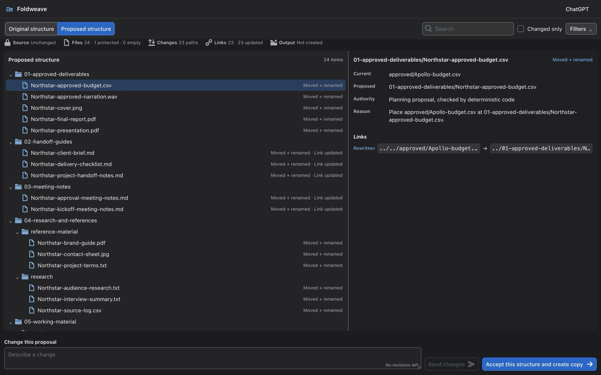
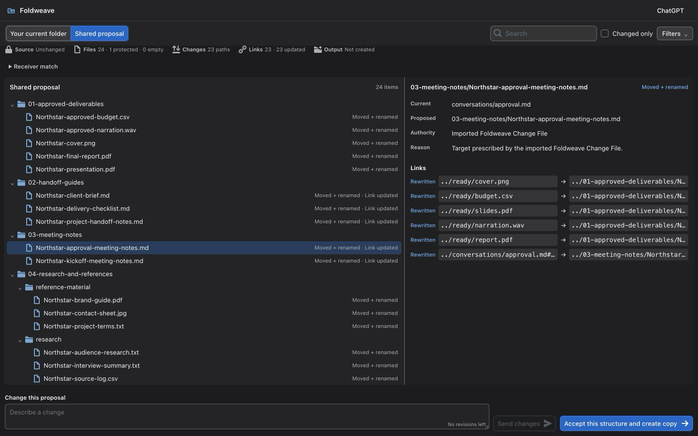

# Foldweave

**Change the structure. Keep the connections.**

> OpenAI Build Week 2026 · **Work & Productivity** · Native release tested on
> macOS Apple Silicon

**Foldweave is a deterministic change engine for connected project folders.
GPT-5.6 proposes a structure. Foldweave checks it, shows it to the user, and can
apply the same approved change to another strictly equivalent copy even when
that copy uses different local paths.**

A project folder is more than a list of files. Notes point to reports, briefs
point to research, and delivery instructions point to approved assets. Moving
the files without updating those connections breaks the project. Foldweave
moves the structure as a whole, updates supported Markdown links, and packages
the approved organization as a **Foldweave Change File**. The Change File
carries the plan and proof data, not the project files themselves.

Before any result is created, Foldweave shows the full current tree beside the
proposed one. The user can revise the proposal or accept what is on screen. Only
acceptance creates a separate verified copy. The original folder is left
untouched.

[Watch the 2:16 demo](https://youtu.be/JpHIoLa-hZI) ·
[Try the keyless replay](#try-foldweave-in-five-minutes) ·
[See how the cross-layout matching works](#the-key-idea-one-change-different-layouts)



## What makes Foldweave different

Most folder automation records paths: “move A to B.” That recipe stops working
as soon as another copy of the project is organized differently. Asking a model
to reorganize every copy from scratch is not reliable either, because each run
can produce a different result.

Foldweave makes the **change itself** portable. Sofia can plan and approve one
organization, then send it to Martin as a Foldweave Change File. Foldweave
recognizes Martin's corresponding files from exact content descriptors and
supported-link relationships instead of Sofia's paths. Martin can apply the
same change with no model call or use it as the starting point for his own
proposal. Both people can verify what happened, and both original folders stay
untouched.

Codex was the main build and integration environment for Foldweave, and it is
also a working host through the product's MCP tools. In direct mode, GPT-5.6
proposes the structure. In ChatGPT and Codex, the host model uses the same
bounded planning tools. The deterministic engine underneath does not change.

## Why Foldweave exists

Consider a consultant handing a project to a client, a researcher preparing a
study archive, or a small agency cleaning up a delivery folder. The current
layout grew organically. Some filenames are inconsistent. Drafts and approved
material are mixed together. Markdown notes contain relative links that depend
on today's paths.

The usual approaches leave an important gap:

- **Manual reorganization is understandable but fragile.** Moving one file can
  break references elsewhere, and proving that nothing was lost is tedious.
- **A fixed script can move files reliably but cannot understand a plain-English
  request** such as “separate approved deliverables from working material and
  prepare this project for handoff.”
- **An unconstrained AI agent can understand the request but should not be the
  authority that mutates the filesystem, approves its own plan, or declares its
  own work correct.** Running the same prompt independently on two copies can
  also produce two different organizations.

Foldweave gives each part of the job to the right authority. GPT-5.6 interprets
the request. Fixed code accounts for every file, validates the plan, and updates
supported links. The user approves the exact structure. The verifier checks the
result without trusting the model or the interface.

## What a Foldweave transaction looks like

### 1. Describe the outcome

Choose a local folder and write an ordinary request:

> Prepare this Apollo client-project folder for handoff as Northstar. Keep every
> file. Organize approved deliverables, working material, research, and meeting
> notes into clear folders, and keep every supported link working.

### 2. Plan with bounded evidence

The planner can inspect the relative inventory, selected eligible text
excerpts, and supported Markdown-link evidence. It cannot read protected
credentials, issue filesystem commands, execute a plan, or manufacture proof.

### 3. Compile and stop at review

Foldweave turns the model proposal into one immutable preview. At this point:

- the source has not changed;
- no result folder exists;
- every admitted file and explicit empty directory is represented;
- protected members, collisions, unsafe paths, and supported links have been
  checked; and
- the exact proposed tree and link rewrites are visible.

### 4. Revise or accept

The user can send a focused change request. Foldweave applies the model's sparse
revision to the prior candidate, rebuilds the complete plan, and reruns every
mechanical check. A failed revision leaves the prior valid preview intact.

The primary action says exactly what it does: **Accept this structure and create
copy**.

### 5. Create the result and verify it

After exact acceptance, Foldweave creates a separate result, rewrites only the
supported Markdown destination spans, and verifies the transaction. The result
contains the organized data plus versioned plans, maps, a receipt, verification
evidence, and the information needed to recreate the selected source layout and
bytes in a new location.

The selected source is never renamed, edited, or deleted in place.

## The key idea: one change, different layouts

This is what makes Foldweave useful beyond one person's machine.

Sofia and Martin have the same supported project, but years of handoffs and
personal organization have left them with different paths. In the bundled
24-file demonstration, the same logical members begin like this:

| Logical member | Sofia's path | Martin's path | Shared target |
|---|---|---|---|
| Client brief | `briefing/Apollo-client-brief.md` | `intake/client/brief.md` | `handoff-guides/Northstar-client-brief.md` |
| Kickoff notes | `notes/meetings/Apollo-kickoff-notes.md` | `conversations/kickoff.md` | `meeting-notes/Northstar-kickoff-notes.md` |
| Approved budget | `approved/Apollo-budget.csv` | `ready/budget.csv` | `approved-deliverables/Northstar-budget.csv` |

Sofia asks GPT-5.6 for the Northstar handoff structure, reviews it, requests a
small revision, and accepts it. Foldweave creates her verified result and a
**Foldweave Change File**.

That Change File does **not** contain Sofia's PDFs, images, audio, spreadsheets,
or document payloads. It contains the reviewed structural intent and the exact
descriptors, supported-link relationships, fingerprints, and proof identifiers
needed to recognize an equivalent project.

Martin then chooses two local items:

1. Sofia's Foldweave Change File; and
2. his differently arranged copy of the project.

Foldweave does not assume that Sofia's paths exist on Martin's machine. It
builds a deterministic one-to-one correspondence:

- ordinary files are described by kind, byte size, SHA-256, suffix, and
  protection status;
- Markdown files are described by all bytes outside supported link destinations
  plus the ordered link slots, fragments, and relationship structure;
- incoming and outgoing Markdown relationships refine possible matches until
  each member is unique;
- protected members and explicit empty directories retain their stricter path
  requirements; and
- if any member is missing, extra, changed, or still ambiguous, the transaction
  blocks instead of guessing.

After every member has one unambiguous match, Foldweave applies Sofia's target
structure to Martin's actual files. The screen compares Martin's **Your current
folder** with Sofia's **Shared proposal**. Martin then chooses:

- **Accept unchanged:** create and verify the shared organization with no GPT
  call, no API key, and no model fallback; or
- **Build the next proposal:** ask GPT-5.6, ChatGPT, or Codex for a bounded
  derivative revision, review the complete replacement, and export a new
  self-contained Change File only after verified execution.



Martin can send his revised Change File back to Sofia. If each copy still meets
the supported contract, both people can produce the same organized tree. Each
transaction can also restore the exact local layout it began with. The
collaboration is serial and explicit. Foldweave does not live-sync, merge
branches automatically, or reconcile independently edited projects.

## Why execution can be trusted

Foldweave keeps four responsibilities separate:

| Authority | Responsibility | What it cannot do |
|---|---|---|
| Model | Propose one complete plan or one bounded revision | Mutate files, accept a proposal, bypass checks, or create proof |
| Deterministic engine | Scan, match, compile, rewrite links, create the copy and receipt, verify, and reconstruct | Invent user intent or silently resolve ambiguity |
| User | Review and authorize one exact preview | Accidentally authorize a stale or substituted preview |
| Independent verifier | Recompute receipt, artifact, link, and organized-tree consistency | Trust the planner or UI merely because they reported success |

When the user accepts, Foldweave records which job revision, source, preview,
and destination were approved. A stale tab, changed input, double-click, retry,
or simultaneous revision cannot silently execute a different plan.

## Four ways to use the same engine

| Mode | Planning | Credential behavior |
|---|---|---|
| **Native direct API** | Exact `gpt-5.6` through the OpenAI Responses API | Uses the user's API key from macOS Keychain; direct API billing is separate from ChatGPT |
| **ChatGPT-hosted** | The model supplied by the user's ChatGPT session calls bounded Foldweave tools | No Foldweave Responses API key and no hidden direct API call |
| **Recorded replay** | Replays exact, labelled planning evidence | Keyless and model-free; ideal for evaluation |
| **Unchanged Change File application** | Deterministic matching and rebinding only | Keyless and model-free |

Codex is an additional host over the same bounded MCP tools and durable job
authority. Native, browser, CLI, ChatGPT, and Codex surfaces do not contain
separate planners or execution engines.

## Try Foldweave in five minutes

The fastest judge path is the bundled recorded replay. It needs no API key,
ChatGPT login, Cloudflare account, or network model request.

### Prerequisites

- macOS on Apple Silicon;
- Python 3.11; and
- [`uv`](https://docs.astral.sh/uv/).

### Run the complete review flow

```bash
git clone https://github.com/ModernBlueprints/Foldweave.git
cd Foldweave
uv sync --frozen

DEMO_ROOT="$(mktemp -d "${TMPDIR:-/tmp}/foldweave-judge.XXXXXX")"
uv run foldweave demo --mode replay --root "$DEMO_ROOT"
uv run foldweave app --browser --mode development \
  --job "$DEMO_ROOT/jobs/active.json"
```

Leave that terminal running. Foldweave prints its private loopback address but
does not open a browser for you. Open it from a second terminal:

```bash
open http://127.0.0.1:8000
```

In the review screen:

1. switch between **Original structure** and **Proposed structure**;
2. inspect a moved Markdown file and its rewritten links; and
3. select **Accept this structure and create copy**.

The source remains unchanged. In a second terminal, independently verify the
result and recreate Sofia's exact starting layout:

```bash
RESULT="$DEMO_ROOT/results/Northstar-client-project-handoff"
uv run foldweave verify-receipt "$RESULT" \
  --source "$DEMO_ROOT/fixture/sofia-apollo"
uv run foldweave restore-receipt "$RESULT" "$DEMO_ROOT/restored"
diff -qr "$DEMO_ROOT/fixture/sofia-apollo" "$DEMO_ROOT/restored"
```

`diff` produces no output when reconstruction is exact. The replay is visibly
labelled **Recorded GPT planning run**; it is not presented as a live provider
call.

The sample is entirely synthetic. It contains 24 files across Markdown, text,
CSV, PDF, images, audio, XLSX, and opaque binary data, plus one protected file
and one explicit empty directory. Opaque formats are carried byte-for-byte;
Foldweave does not claim to understand their contents. See
[`sample_data/README.md`](sample_data/README.md) for provenance.

## Other judge paths

### Build the native macOS application

```bash
uv run pyinstaller --noconfirm --clean packaging/Foldweave.spec
open dist/Foldweave.app
```

The tested native release is an unsigned/ad-hoc Apple-Silicon judge build. It
is not Developer-ID signed or notarized, so macOS may require an explicit local
launch action. The browser path above uses the same local engine and remains
the simplest evaluation route.

### Use live GPT-5.6 planning

Provide `OPENAI_API_KEY` only through the trusted local environment, or enter it
in Foldweave's Keychain-backed native settings. Then prepare a job:

```bash
uv run foldweave run --mode live \
  --source SOURCE_ROOT \
  --output OUTPUT_PARENT \
  --job JOB_FILE \
  --request "Prepare this project for handoff. Keep every file and every supported link working."

uv run foldweave preview JOB_FILE
```

The command stops at review. Use `foldweave revise` for an optional bounded
change and `foldweave accept` with the displayed preview fingerprint to create
the separate result. Direct mode uses exact alias `gpt-5.6`, strict tools and
schemas, `store=false`, no fallback model, and no provider retry. `store=false`
is not a zero-retention guarantee.

### Apply a shared Foldweave Change File

```bash
uv run foldweave apply-change CHANGE_FILE \
  --source RECEIVER_SOURCE \
  --output OUTPUT_PARENT \
  --job RECEIVER_JOB

uv run foldweave preview RECEIVER_JOB
uv run foldweave accept RECEIVER_JOB \
  --preview-fingerprint PREVIEW_SHA256 \
  --idempotency-key judge-receiver-accept-01
```

Preparation, matching, and unchanged application are model-free. A mismatch
never triggers semantic guessing or a hidden GPT fallback.

### Install the Codex plugin

From the repository root:

```bash
CODEX_BIN="/Applications/ChatGPT.app/Contents/Resources/codex"
"$CODEX_BIN" plugin marketplace add .
"$CODEX_BIN" plugin add foldweave@personal
```

Refresh or restart Codex, then open a new task rooted in the clone. The plugin
launches the repository's local STDIO MCP server and exposes bounded planning,
review, acceptance, verification, and reconstruction tools. It never exposes
arbitrary filesystem or shell access. Full install, use, and uninstall
instructions are in
[`plugins/foldweave/README.md`](plugins/foldweave/README.md).

## Architecture

```text
Foldweave.app   Browser   CLI   ChatGPT widget   Codex plugin
      \            |      |          |               /
       +-----------+------+----------+--------------+
                              |
                one FastAPI control plane
                              |
          one durable FolderRefactorJobV3 authority
                              |
     scanner -> planner tools -> compiler -> immutable preview
                              |
       copy transaction -> receipt -> verifier -> reconstruction
```

- **Python 3.11, Pydantic v2, FastAPI, and standard filesystem primitives**
  implement the local domain engine and strict versioned contracts.
- **React 18, TypeScript, BlueprintJS, and Vite** implement the focused visual
  review tree shared by the native/browser surface and ChatGPT widget.
- **pywebview and PyInstaller** provide the narrow macOS shell; Keychain stores
  the direct API credential outside React and browser storage.
- **MCP** exposes the same bounded domain operations to Codex and ChatGPT.
- **A Cloudflare Workers OAuth gateway and outbound paired companion** let
  ChatGPT reach the local engine without exposing a public inbound listener or
  sending absolute local paths through the gateway.
- **BagIt and canonical SHA-256 commitments** support portable receipts,
  independent verification, Change Files, and reconstruction.

The gateway is transport, not product authority. Durable job state, file
access, execution, proof, and idempotency remain local.

## Supported boundary

Foldweave accepts an existing readable folder with up to 500 regular files,
1,000 directories, and 10,000 supported local Markdown references. It includes
hidden regular files and explicit empty directories, and blocks on symlinks,
hard links, special or unreadable members, changing input, unsafe overlap, an
existing destination, or inadequate capacity.

“Connections” currently means UTF-8 inline Markdown links and images whose
destinations are relative local files inside the selected root, including safe
in-root `../` paths and optional fragments. Foldweave rewrites only the exact
destination spans. It does not claim to understand references embedded in
source code, databases, Office documents, PDFs, design files, spreadsheets, or
media.

A Foldweave Change File contains no project payload bytes, but it does disclose
project names and structure, file sizes and hashes, supported-link
relationships, the instruction, target names, immediate-parent lineage where
applicable, and proof identifiers.

The receiver must still contain the same supported project. If a file is
missing, extra, changed, or impossible to match uniquely, Foldweave stops
instead of guessing. It does not try to merge independently edited copies or
authenticate the sender of a Change File.

Only macOS Apple Silicon has been tested as a native application. The complete
boundary is in
[`docs/LIMITATIONS.md`](docs/LIMITATIONS.md).

## How Codex and GPT-5.6 were used

### I began with a project-selection tournament

Before writing product code, I used Codex to compare several Build Week ideas.
I tested each idea against user value, technical feasibility, differentiation,
demo clarity, and whether I could build one complete trustworthy transaction
in the available time. That process led me to the connected-folder problem and
one clear rule: **let AI interpret intent, but keep execution, verification, and
final approval under deterministic and human control.**

The tournament was a decision tool, not part of the Foldweave runtime. Its
scoring and evaluator machinery is intentionally not included in this product
repository.

### Codex was the primary build and integration environment

Codex was my main development environment. I used it to turn the selected idea
into working end-to-end flows, then to attack the cases that could make those
flows incorrect or misleading. It accelerated work on:

- the scanner, compiler, safe path rules, Markdown link rewriting, and copy
  transaction;
- review jobs, revisions, exact acceptance, retries, race handling, and restart
  recovery;
- path-independent receiver matching, Change File lineage, receipts,
  independent verification, convergence, and source-specific reconstruction;
- the native macOS application, focused React review UI, ChatGPT widget, Codex
  plugin, MCP services, OAuth gateway, and paired companion; and
- regression tests, refusal cases, packaging, visual review, documentation, and
  the final demo.

I made the main product decisions: no in-place mutation; review before
execution; supported Markdown links rather than vague “all connections”;
deterministic ambiguity blocking; exact preview-bound acceptance; and truthful
privacy, platform, and publication claims. The chronological record is in
[`docs/CODEX_BUILD_LOG.md`](docs/CODEX_BUILD_LOG.md).

### GPT-5.6 plans; Foldweave executes

Native direct mode calls exact `gpt-5.6` through the Responses API. GPT-5.6 can
inspect the bounded inventory, selected text excerpts, and supported-link
evidence. It can submit one complete plan, ask one essential clarification, or
propose a focused revision. It cannot change the source, approve its own
proposal, bypass the compiler, produce a receipt, or mark a result verified.

ChatGPT-hosted and Codex-hosted planning use the model supplied by the host
through the same bounded tools. Neither route silently calls the Foldweave
Responses API. Recorded replay and unchanged Change File application are
model-free.

## Development checks

```bash
uv lock --check
PYTHONDONTWRITEBYTECODE=1 uv run --no-sync pytest -p no:cacheprovider
uv run --no-sync ruff check .
uv run --no-sync ruff format --check .
```

Frontend and gateway checks are documented in their package scripts and in
[`docs/build/IMPLEMENTATION_PLAN.md`](docs/build/IMPLEMENTATION_PLAN.md).

## License and provenance

Foldweave is released under the [MIT License](LICENSE). Third-party notices are
in [`THIRD_PARTY_NOTICES.md`](THIRD_PARTY_NOTICES.md). The boundary between the
Build Week implementation, earlier mechanical lessons, historical Name Atlas
artifacts, and excluded tournament machinery is documented in
[`docs/PREEXISTING_WORK.md`](docs/PREEXISTING_WORK.md).

The demo narration was generated with OpenAI Text-to-Speech from an
evidence-checked script and is identified as such in the video.
