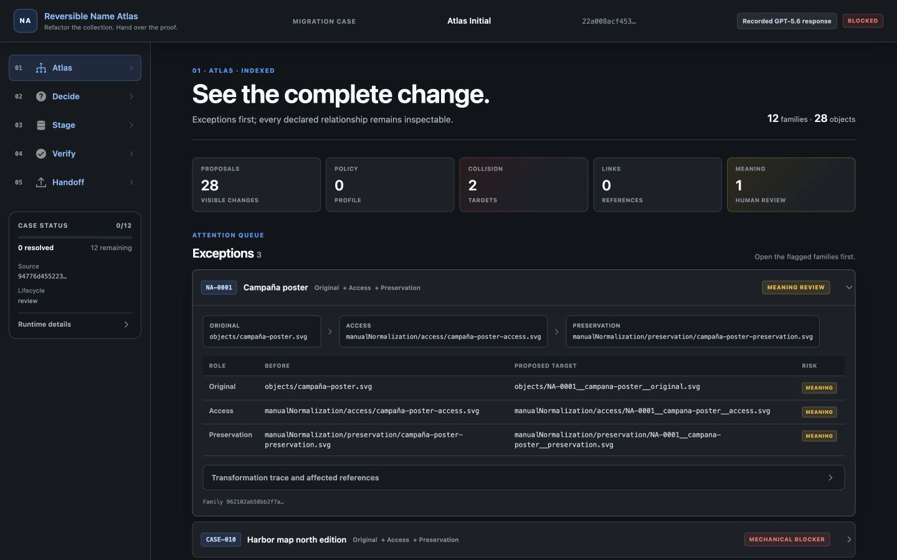
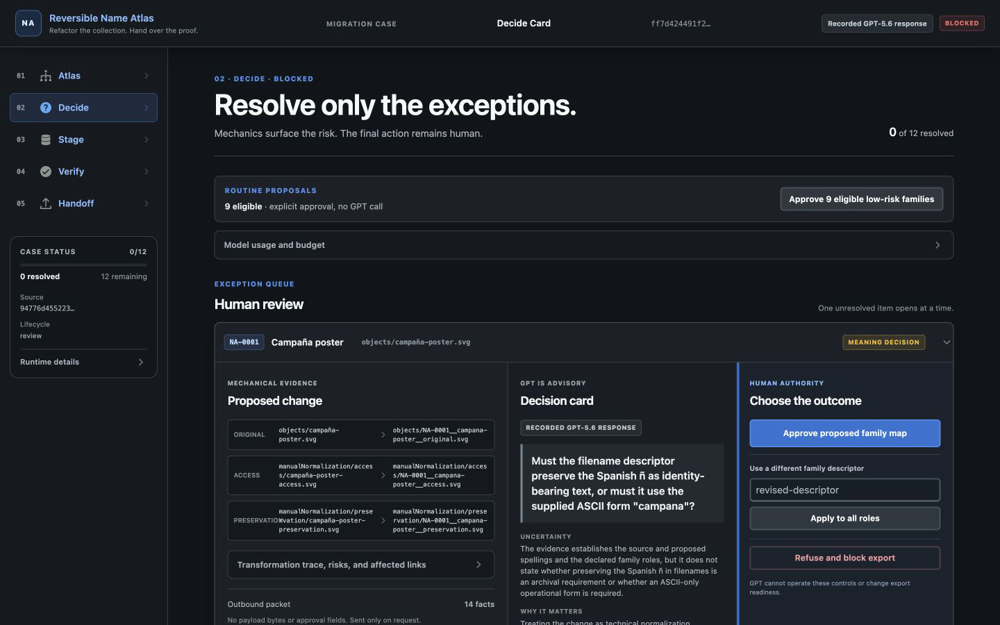
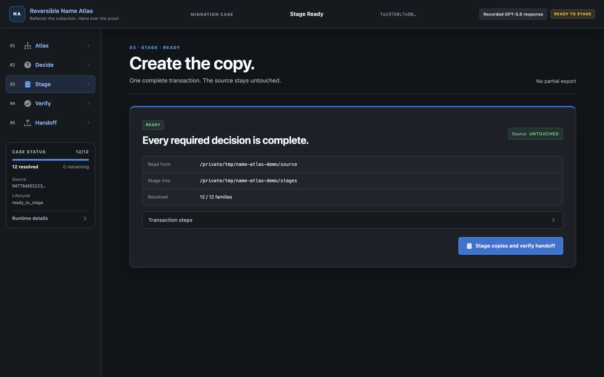
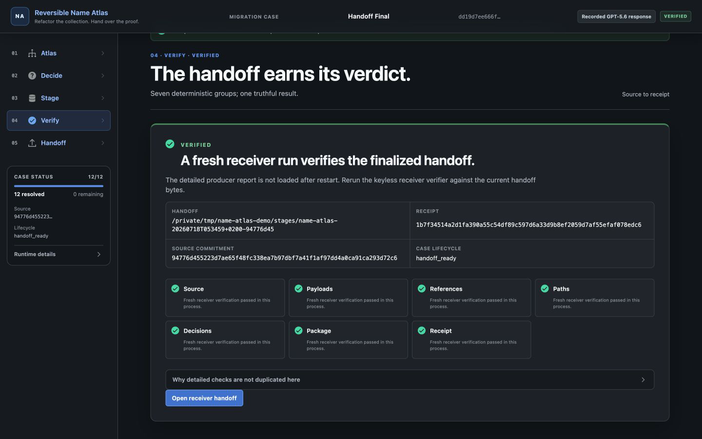
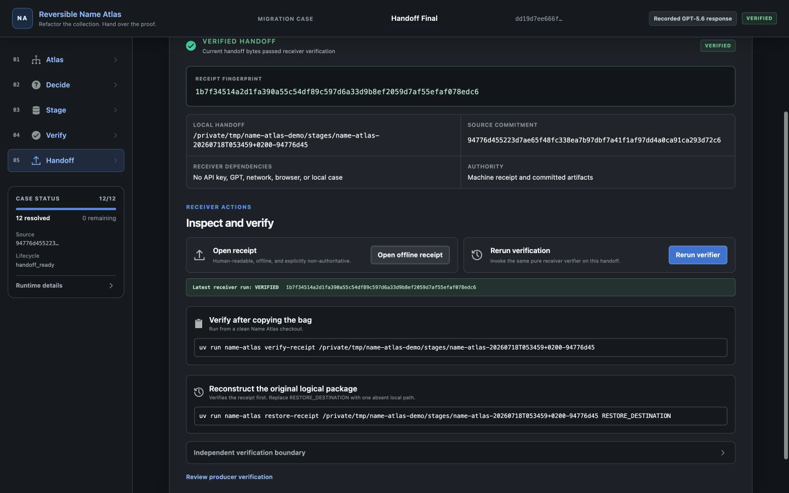
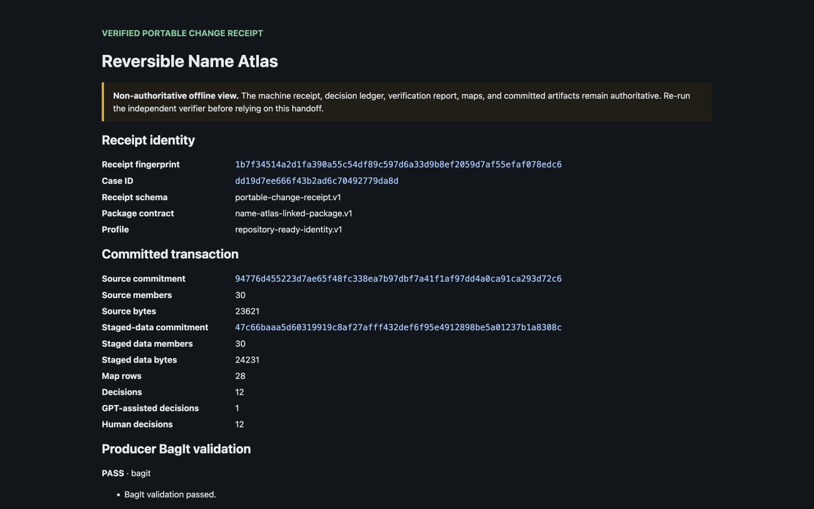
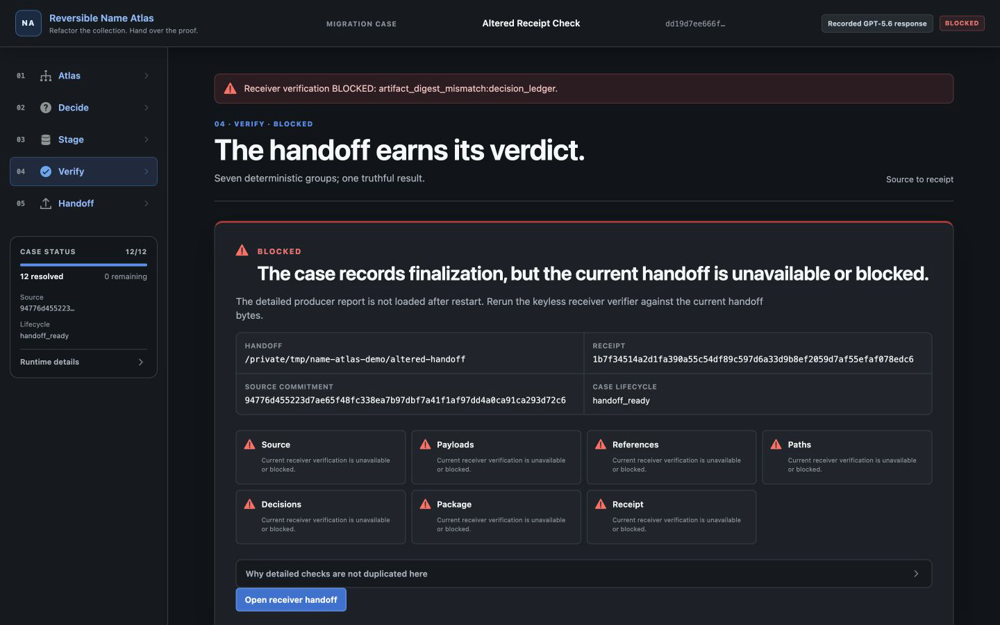

# Reversible Name Atlas

**Refactor the collection. Hand over the proof.**

Reversible Name Atlas is a local migration workbench for linked digital
collections. It turns a risky rename or structural migration into a persistent,
human-reviewed **Migration Case**, then creates a copy-only BagIt handoff with a
portable **Change Receipt** that another person can verify without the original
workbench, case file, API key, or network connection.

The first user is a digital-preservation specialist or processing archivist
preparing a collection for preservation or repository ingest. The problem is
larger than changing filenames: one identity may also appear in metadata,
derivative relationships, paths, and manifests. Name Atlas makes the complete
supported change visible, isolates the exceptions that require judgment,
propagates each human decision through declared links, and blocks the whole
handoff if any required invariant remains unresolved.

The end-to-end transaction is:

```text
linked source package
  → persistent Migration Case
  → mechanical path proposals and risk detection
  → bounded GPT-5.6 evidence where Meaning review is required
  → explicit human decisions
  → copy-only staged BagIt package
  → portable Change Receipt
  → independent receiver verification
  → optional bounded logical restore
```

## What the product proves

Name Atlas separates four kinds of authority:

| Surface | Authority |
|---|---|
| Migration Case | The sole mutable authority while a migration is being reviewed |
| Decision ledger | The complete portable record of proposals, GPT evidence where applicable, and explicit human actions |
| Verification report | The producer's deterministic findings for the staged transaction |
| Change Receipt | The immutable envelope, fingerprints, artifact commitments, counts, and claim boundaries handed to a receiver |

The human-readable Markdown summary and offline HTML receipt are committed,
non-authoritative views of those machine records.

A successful handoff also passes Library of Congress `bagit` validation, but
BagIt and Name Atlas answer different questions:

- **BagIt validation** checks the bag's declared payload and tag-file fixity and
  completeness.
- **Name Atlas verification** checks that the receipt, source description,
  original controls, decision ledger, path maps, staged controls, payloads, and
  producer report describe one internally consistent supported migration.

The controlled negative demonstration makes this distinction visible: changing
one resolved target in the decision ledger and rebuilding the ordinary BagIt tag
manifest can leave BagIt validation passing, while `verify-receipt` blocks on
`artifact_digest_mismatch:decision_ledger` because the ledger no longer matches
the immutable receipt commitment.

This is an integrity and internal-consistency proof within one supported package
contract. It is not semantic-correctness, sender-authentication, compliance,
historical-source-authenticity, or universal-reversibility proof.

## Authority model

| Actor | What it does | What it cannot do |
|---|---|---|
| Deterministic engine | Scans declared structure, proposes paths, detects mechanical risk, propagates decisions, stages copies, and verifies invariants | Infer semantic intent |
| GPT-5.6 | Turns bounded, visible text evidence for a mechanically flagged Meaning risk into a neutral, evidence-linked decision card | Approve, edit, verify, select a final target, or make a package exportable |
| Human | Approves, edits, refuses, or leaves each family unresolved | Bypass mechanical blockers or verification failures |

Green is reserved for deterministic verification after all required human
decisions. Amber means human judgment remains. Red means a mechanical blocker or
failed invariant. GPT prose is displayed neutrally.

The loopback application sends no source payload bytes to GPT-5.6. In live mode,
it shows the complete bounded outbound text and waits for the user to request a
card. The exact card presented, its evidence and fingerprints, and the later
human action are persisted together. GPT output never becomes human approval.

## Supported package contract

Name Atlas intentionally supports one package shape and one transformation
profile:

```text
<selected-root>/
├── objects/
│   └── ... original regular files ...
├── manualNormalization/
│   ├── access/
│   │   └── ... optional access derivatives ...
│   └── preservation/
│       └── ... optional preservation derivatives ...
├── metadata/
│   └── metadata.csv
└── normalization.csv  # optional when no derivatives exist
```

Core rules:

- every source-package member is an in-scope regular file; symlinks, special
  files, path traversal, absolute references, and unexpected members fail
  closed;
- `metadata/metadata.csv` is required UTF-8 CSV with `filename` first and
  exactly one `dc.identifier` column;
- each identifier is non-empty, NFC-normalized, unique, at most 64 characters,
  and matches `[A-Za-z0-9][A-Za-z0-9._-]{0,63}`;
- metadata contains exactly one row for every original below `objects/`;
- optional `normalization.csv` is headerless UTF-8 CSV with exactly the fields
  `original,access derivative,preservation derivative`;
- an original has at most one access and one preservation derivative, and every
  derivative is declared exactly once;
- only declared path-reference fields are rewritten in the staged control
  files; other supported metadata values remain unchanged; and
- malformed, ambiguous, orphaned, colliding, refused, unresolved, changed, or
  unsupported input blocks the complete package before promotion.

The fixed **Repository-ready identity profile** derives one descriptor from the
original filename, adopts the family's `dc.identifier`, adds an explicit role,
and proposes leaves of the form:

```text
{identifier}__{descriptor}__{role}{lowercase_extension}
```

Targets are checked independently under exact, NFC, and Unicode-casefold
comparison. The staging transaction never renames, edits, or deletes the source
package.

See the exact contract in
[`docs/build/BUILD_SPEC.md`](docs/build/BUILD_SPEC.md) and the bounded exclusions
in [`docs/LIMITATIONS.md`](docs/LIMITATIONS.md).

## Quick start

Prerequisites:

- Python 3.11; and
- [`uv`](https://docs.astral.sh/uv/).

The tested Build Week judge path is macOS with Python 3.11. Linux and Windows are
not release-test claims.

From a clean clone:

```text
git clone https://github.com/ModernBlueprints/reversible-name-atlas.git
cd reversible-name-atlas
uv sync --frozen
uv run name-atlas demo --mode replay
```

Open <http://127.0.0.1:8000>. Replay mode needs no API key and uses the included
sanitized record from one real, validated `gpt-5.6` response. The UI labels it
**Recorded GPT-5.6 response**. The record is bound to the exact hero evidence
fingerprint and is never reused for a different source.

For live mode, configure `OPENAI_API_KEY` in the launching environment. Do not
put the key in this repository, command history, screenshots, logs, or chat.
Then run:

```text
uv run name-atlas demo --mode live
```

Live mode uses the exact `gpt-5.6` alias and has no silent fallback. Without a
nonblank local key it exits before the server starts. A provider request occurs
only when the user explicitly requests the mechanically flagged Meaning card.

## Migration Cases and restart

`demo` creates an absent Migration Case or resumes an existing one. It prints the
exact local case path at startup.

By default, the case is stored under `.name-atlas/cases/` with a deterministic
16-hex-character filename derived from the resolved source root. Select an exact
path with `--case`:

```text
uv run name-atlas demo --mode replay \
  --source "/absolute/path/to/supported-package" \
  --output "/absolute/path/to/staging-parent" \
  --case "/absolute/path/to/migration.case.json"
```

Use the same source, output parent, and case path to resume. The case retains its
stable ID, proposals, any exact evidence and card records, human decisions,
resolved targets, revision, lifecycle, and local handoff pointer. It is saved
atomically, revision-checked, and held by one process writer; a second writer
fails closed.

Before a non-finalized case loads or mutates, Name Atlas re-scans the source and
rebuilds deterministic authority. An added, removed, renamed, resized, or
content-changed source member makes the case terminally `stale`, records the
exact difference, and blocks decisions, staging, and receipt generation.
Preserve the stale case and start again with a different, absent `--case` path;
there is no destructive reset or automatic decision carry-forward.

A finalized `handoff_ready` case is read-only historical evidence. Later source
changes do not rewrite it. Use `verify-receipt --source` when you need to compare
the committed source description with a source tree that is available now.

## Five-state workbench

The application is server-rendered and loopback-only. The five routes remain
directly inspectable even when their prerequisites are incomplete:

1. **Atlas — `/atlas`**: source commitment, object families, original and
   derivative relationships, before/after paths, risks, and affected references.
2. **Decide — `/decide`**: unresolved exceptions, collision edits, bounded
   Meaning evidence, neutral GPT card, and explicit human actions.
3. **Stage — `/stage`**: readiness and blockers, source and destination,
   source-untouched statement, and the one copy-only staging action.
4. **Verify — `/verify`**: one `VERIFIED`, `BLOCKED`, or `INCOMPLETE` verdict
   across Source, Payloads, References, Paths, Decisions, Package, and Receipt.
5. **Handoff — `/handoff`**: receipt identity, offline receipt, copyable verifier
   and restore commands, and a receiver-oriented rerun of verification.

`GET /` computes the next state from durable server authority: a stale or
unavailable case goes to Atlas; unresolved or refused required decisions go to
Decide; resolved decisions go to Stage; the completed staging action redirects
to Verify; and a finalized handoff goes to Handoff. The release requires no
client-side JavaScript: every state and transition is owned by the
server-rendered application.

The dark visual layer uses locally packaged assets from Blueprint core `6.17.2`
and Blueprint icons `6.13.0`. There is no CDN, React, Vite, Node runtime, or Node
judge step. Attribution, upstream fingerprints, selected assets, and the
Apache-2.0 license pointer are in
[`THIRD_PARTY_NOTICES.md`](THIRD_PARTY_NOTICES.md).

## Release tour

The revised release captures show the same supported hero transaction from
source inspection through receiver handoff:















## Hero walkthrough

The included [`sample_data/hero`](sample_data/hero) fixture is synthetic and
redistributable. It contains 12 object families, 28 content objects, and 30
source-package members.

1. Start the hero in replay mode and inspect **Atlas**. It shows stable families,
   declared derivative links, the fixed profile, proposed moves, and Policy,
   Collision, Links, and Meaning risk counts.
2. In **Decide**, batch-approve the nine initially eligible low-risk families.
   This deterministic path makes no GPT call.
3. Resolve the casefold collision between `CASE-010` and `case-010` by editing one
   family descriptor, for example to `harbor-map-north`, then batch-approve the
   now-unblocked counterpart.
4. Inspect the exact `NA-0001` Meaning evidence and the card labeled **Recorded
   GPT-5.6 response**. Answer the question yourself and edit the descriptor to
   `campaign-poster`. GPT-5.6 did not select or populate this target.
5. In **Stage**, run the complete copy-only transaction. The source remains
   untouched; a pending package is promoted only after producer proof, final
   BagIt validation, and independent receiver verification all pass.
6. Inspect the grouped deterministic result in **Verify**, then use **Handoff**
   to open the offline receipt and copy the keyless receiver command.
7. Verify the copied handoff from another location. Optionally restore it to a
   new, absent destination and compare the reconstructed supported package.

The separate
[`sample_data/negative_unresolved_meaning`](sample_data/negative_unresolved_meaning)
fixture contains one family and proves that an unresolved Meaning decision
produces no staged handoff.

## Portable handoff artifacts

A completed handoff stores the transformed logical collection below `data/`,
standard BagIt files, and these receipt-bound tag artifacts:

- `name-atlas/source_snapshot.json` — path-neutral committed source description;
- `name-atlas/original-control/metadata/metadata.csv` — byte-exact original
  metadata control;
- `name-atlas/original-control/normalization.csv` — byte-exact original
  normalization control when the source had one;
- `name-atlas/decision_ledger.json` — complete proposal, evidence/card where
  applicable, and human-decision authority;
- `name-atlas/forward_path_map.csv` and `reverse_path_map.csv`;
- `name-atlas/verification_report.json` — deterministic producer findings;
- `name-atlas/verification_summary.md` — committed human-readable summary;
- `name-atlas/change_receipt.json` — immutable machine receipt envelope;
- `name-atlas/change_receipt.html` — self-contained offline view; and
- `bagit.txt`, `bag-info.txt`, `manifest-sha256.txt`, and
  `tagmanifest-sha256.txt`.

The receipt fingerprint is SHA-256 over a canonical receipt core that does not
contain its own fingerprint. It commits the exact authoritative artifact bytes
and a complete staged-data commitment; the final BagIt tag manifest then
protects the receipt JSON and HTML.

The phrase **Verified round-trip integrity within the supported package
contract** appears only after every required source, payload, control-file,
reference, profile, collision, path-map, reverse-dry-run, human-decision, report,
and BagIt check passes. It is deliberately narrower than semantic correctness,
historical-source authenticity, full filesystem preservation, or universal
reversibility.

## Independent receiver verification

Verify a received bag without a case file, original source, API key, GPT call,
network, or browser:

```text
uv run name-atlas verify-receipt RECEIVED_BAG
```

The verifier performs no writes. It re-runs BagIt validation, validates strict
artifact schemas and raw commitments, recomputes staged-data and receipt
fingerprints, and reconstructs the supported transaction from portable evidence.

Exit behavior:

- `0`: prints `VERIFIED <receipt-fingerprint>`;
- `1`: prints `BLOCKED <stable-failed-check-ids>`; and
- `2`: usage error, or the input cannot be opened as a candidate handoff.

Source-free verification proves internal transaction consistency against the
source description committed by the receipt. It does **not** prove that this
description is an authentic historical source. If the original source is
available, compare it separately:

```text
uv run name-atlas verify-receipt RECEIVED_BAG \
  --source "/absolute/path/to/source-root"
```

The optional comparison passes only when every supported source path, role,
size, and SHA-256 equals the committed portable snapshot.

## Bounded logical restore

Restore has passed its release gate and ships as a verify-first, copy-only
command:

```text
uv run name-atlas restore-receipt RECEIVED_BAG RESTORE_DESTINATION
```

`RESTORE_DESTINATION` must not already exist and cannot be inside the received
bag. The command verifies the receipt, reconstructs content through the reverse
map, restores byte-exact original control files, reimports the pending directory
through the strict package parser, proves exact portable-snapshot equality,
verifies the unchanged handoff again, and then promotes the pending directory
without replacement.

Exit behavior:

- `0`: prints `RESTORED <receipt-fingerprint> <absolute-destination>`;
- `1`: prints a transaction or integrity blocker; and
- `2`: usage error, or the input cannot be opened as a candidate handoff.

The restore result is external to the immutable bag; the command does not edit
the receipt or handoff. Its bounded claim is exactly that it reconstructs every
in-scope source-package member byte-for-byte within the supported Name Atlas
package contract. It does not restore ACLs, ownership, timestamps, extended
attributes, resource forks, undeclared references, embedded links, or arbitrary
filesystem state.

## Exact judge and maintainer commands

Run from the repository root:

```text
uv sync --frozen
uv run name-atlas demo --mode replay
uv run name-atlas demo --mode live
uv run name-atlas verify-receipt RECEIVED_BAG
uv run name-atlas verify-receipt RECEIVED_BAG --source SOURCE_ROOT
uv run name-atlas restore-receipt RECEIVED_BAG RESTORE_DESTINATION
uv run pytest
uv run ruff check .
uv run ruff format --check .
```

The replay application, receiver verifier, and restore command are keyless.
Only live card generation uses the OpenAI API.

## Troubleshooting

### Replay reports an unavailable or mismatched record

The included record is valid only for the pristine hero evidence fingerprint.
Use the unmodified hero package for the recorded card. A different source with a
Meaning risk requires live mode and a locally configured key; Name Atlas does not
fabricate or reuse a mismatched card.

### Live mode exits before the server starts

Configure a nonblank `OPENAI_API_KEY` in the same local environment that launches
the command. No fallback provider is selected when it is absent.

### Startup reports an invalid package

Compare the selected root with the strict package contract above. The importer
identifies the offending path, row, column, relationship, or invariant and starts
no copy transaction.

### Startup says the case source or output does not match

Resume with the same `--source`, `--output`, and `--case` values used to create
the case. To begin a separate migration, choose a different absent case path.

### The case is locked

Only one process may hold mutation authority for a case. Close the other running
Name Atlas process, then resume the same case. Do not delete the lock or case
file while a process may still own it.

### The case is stale

The source no longer matches the immutable case snapshot. Preserve the stale
case for evidence and create a fresh case at a different absent `--case` path.
Name Atlas intentionally has no reset, rebase, reconciliation, or decision
carry-forward command.

### Staging is disabled

Inspect Decide and Stage. Every family needs an explicit approved or edited
target. A refusal, unresolved Meaning question, collision, invalid target,
stale case, or unsupported input blocks the whole package.

### `verify-receipt` prints `BLOCKED`

Treat the listed stable check IDs as handoff-integrity blockers. A BagIt-valid
result alone is insufficient: regenerate the handoff from an unchanged source
and resolved case rather than editing receipt-bound artifacts in place.

### Restore is blocked

First run `verify-receipt` against the same bag. Use a new absent destination
outside the handoff. The command deliberately refuses overwrite, partial
promotion, invalid receipt authority, and changed handoff bytes.

### A port or staging destination is already in use

Choose another loopback port with `--port` or another staging parent with
`--output`. Name Atlas does not delete an existing handoff to reuse its path.

## Provenance and pre-existing work

All hero and negative-fixture payloads are synthetic; exact fixture provenance
is recorded in [`sample_data/README.md`](sample_data/README.md).

An earlier feasibility spike informed selected mechanical behaviors. The product
has no runtime or test dependency on that ephemeral spike, and its tournament
semantic/evaluator machinery was rejected. Source hashes, adaptation boundaries,
and destination disclosures are recorded in
[`docs/PREEXISTING_WORK.md`](docs/PREEXISTING_WORK.md).

## Built with Codex

Codex with GPT-5.6 is the primary development environment for this Build Week
project. The primary Codex task froze the product contract, implemented and
integrated the Python application, added acceptance and regression tests,
inspected browser behavior, corrected reproduced proof defects, and prepared the
release. Runtime GPT-5.6 has the narrower advisory role described above and is
not the source of human approval or deterministic verification.

Codex accelerated dependency-ordered vertical implementation and parallel,
bounded review. This is a qualitative development-workflow account, not an
unmeasured speed or time-saving claim. The factual development chronology and
live/replay evidence are recorded in
[`docs/CODEX_BUILD_LOG.md`](docs/CODEX_BUILD_LOG.md).

## License

Reversible Name Atlas is distributed under the [MIT License](LICENSE). Read
[`docs/LIMITATIONS.md`](docs/LIMITATIONS.md) before evaluating or adapting the
supported transaction.
