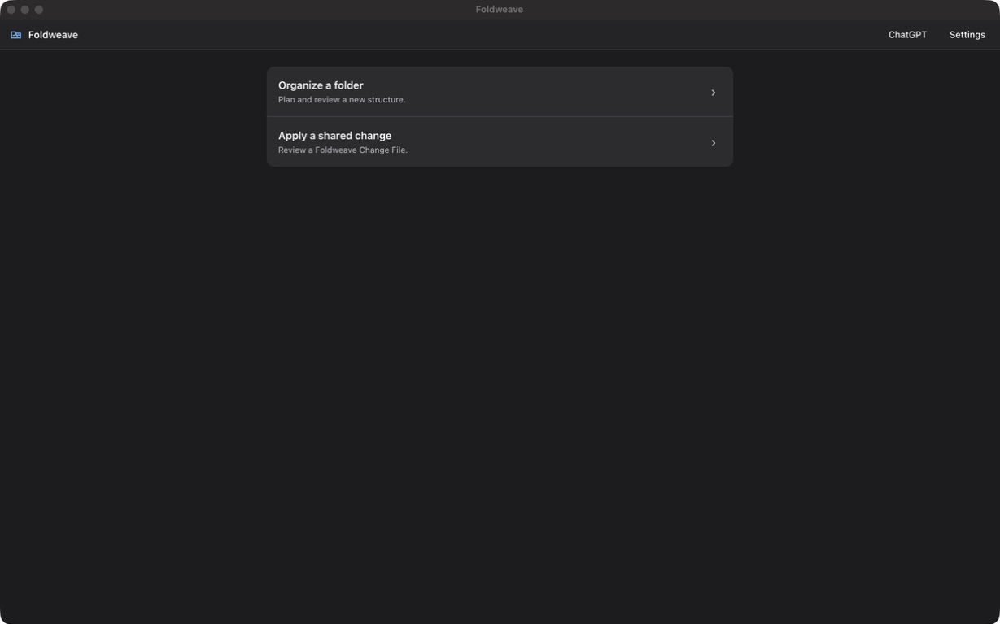

# Foldweave

**Change the structure. Keep the connections.**

> OpenAI Build Week 2026 · **Work & Productivity** · Tested native platform:
> macOS on Apple Silicon

Foldweave is a local-first macOS application for reviewing and applying
AI-planned changes to connected project folders. It renders the complete
current and proposed structures before execution, lets the user request bounded
revisions, and creates a separate verified copy only after the user accepts the
exact preview.

Foldweave keeps every admitted file exactly once, preserves protected members,
rewrites the supported relative Markdown links that connect files, and produces
a payload-free **Foldweave Change File** that another person can review, apply
unchanged, or use as the parent of a new proposal.

> **Current build status:** the Foldweave product release candidate
> `4e9ec44b02b25f515017ceb9922fff4fdf84ae46` and its reconciled release
> evidence are now fast-forwarded to the public Git repository's `main` branch.
> Earlier checkpoint
> `719fc182bbd91e88cd1fa1fd6142d3d061f2aa87` remains the verified integrated
> implementation baseline. The native application,
> review/revision authority, purpose-built macOS visual system, direct planning,
> ChatGPT developer mode, deterministic collaboration proof, and current
> Foldweave installed-copy qualification plus clean-clone plugin/MCP validation
> are recorded. The public gateway, ChatGPT connector OAuth,
> consumer pairing, outbound companion, origin and receiver-derivative
> transactions, reconnect, and refusal paths are also qualified through the
> user-authorized Google Chrome route. Foldweave is technically
> `PUBLICATION_READY` for review submission, but it has not been submitted for
> ChatGPT review, approved, published, or publicly listed. The product release
> and capture package are `RECORDING_READY`: the final Foldweave product and
> under-three-minute recording plan are ready to record. The project is not a
> notarized app, a public ChatGPT listing, a completed public video, a
> `/feedback` Session ID, or a submitted Devpost entry; the submission hold
> remains active.

## Why Foldweave exists

A connected project folder is not just a list of filenames. Notes point to
presentations, briefings point to research, and delivery instructions point to
approved material. A bulk rename can make the tree look cleaner while silently
breaking those relationships. Asking a model to reorganize two equivalent
copies independently can also produce two different structures.

Foldweave separates model judgment from filesystem authority:

1. A model proposes one complete structure from bounded evidence.
2. Deterministic code accounts for every admitted member, checks paths and
   collisions, and derives supported-link rewrites.
3. Foldweave renders one immutable current/proposed preview.
4. The user accepts that exact fingerprint-bound preview or requests a bounded
   revision.
5. Only exact acceptance creates a separate result, receipt, verifier output,
   reconstruction authority, and—where applicable—a Foldweave Change File.

The source is never modified in place. A model cannot write files, approve its
own proposal, bypass the compiler, construct a receipt, or mark a result
verified.

## Two complete user journeys

### Journey A — Create a new Foldweave

Sofia chooses a local project folder and describes the organization she wants.
She may use either native direct API planning or ChatGPT-hosted planning.

```text
local project
  -> bounded model planning
  -> deterministic compilation
  -> Original structure / Proposed structure review
  -> optional bounded revision
  -> exact human acceptance
  -> separate verified result
  -> Foldweave Change File
```

The review is an execution barrier. While the job is in `reviewing`, no result,
receipt, proof, reconstruction authority, or transferable Change File exists.
The primary action is **Accept this structure and create copy**.

### Journey B — Apply or build on a shared change

Martin selects Sofia's Foldweave Change File and his differently arranged but
strictly equivalent project folder. Foldweave verifies the file, scans Martin's
source, performs deterministic complete matching, and renders **Your current
folder** versus **Shared proposal** without calling a model.

Martin can then choose either path:

- **Accept unchanged.** Foldweave makes no model call, reads no API key, and
  makes no direct-API budget reservation. It creates and verifies Martin's own
  separate result.
- **Build the next proposal.** A direct API, ChatGPT, or Codex host proposes a
  bounded revision in a new immutable child job. Martin reviews and accepts the
  complete child preview. Only verified execution can export a complete,
  self-contained child Foldweave Change File.

The parent remains available if a derivative attempt fails. Foldweave supports
explicit serial forks with immediate-parent lineage; it does not implement live
co-editing, automatic merge, accounts, or cloud project synchronization.

## Four execution modes

| Mode | Who supplies inference | Credential and budget behavior |
|---|---|---|
| Native direct API | Exact `gpt-5.6` through the OpenAI Responses API | Uses a user-supplied API key stored in macOS Keychain and the sole bounded direct-API ledger |
| ChatGPT-hosted | The model supplied by the user's ChatGPT session | Uses no Foldweave Responses API key and does not reserve or mutate the direct-API ledger |
| Recorded replay | No model | Keyless, model-free replay of exact labelled planning evidence |
| Unchanged Change File application | No model | Keyless deterministic matching, review, exact application, verification, and reconstruction |

ChatGPT subscription access and OpenAI API billing are separate. OAuth and
pairing authorize access to Foldweave; they do not turn a ChatGPT subscription
into Responses API credit. ChatGPT-hosted mode is genuine only when ChatGPT
supplies inference—there is no hidden direct API fallback.

Codex is an additional access surface over the same bounded MCP and local domain
services. It is not a fifth provenance mode or a second execution engine.

## Current qualification snapshot

The current release record distinguishes the earlier integrated baseline
`719fc182` from product release candidate `4e9ec44`. The following evidence is
backed by the accepted product candidate and the published revision branch:

| Surface | Evidence-backed state |
|---|---|
| Review authority | `GO` — origin and receiver jobs stop at immutable review; stale, duplicate, substituted, and conflicting acceptance paths fail closed |
| Native macOS application | `GO` — clean-clone 55 MiB Apple-Silicon `Foldweave.app`, native picker, temporary Keychain configure/read/remove, unrelated-directory launch, durable restart, review rendering, exact acceptance, verification, reconstruction, and clean shutdown; the qualification credential was removed |
| Native visual system | Objective `GO` — restrained macOS dark utility styling across native, browser, review, settings, pairing, Done/proof, and ChatGPT widget surfaces; no gradients, glow, text shadows, cyber palette, or decorative full-width rules; large/narrow fixtures, keyboard behavior, focus, overflow, and contrast checks passed |
| ChatGPT developer mode | `DEVELOPER_MODE_VERIFIED` — actual macOS ChatGPT, Secure MCP Tunnel, hosted tools, rendered widget, revision, exact widget acceptance, verification, Change File retrieval, and reconstruction; no direct-ledger mutation |
| Review/revision engine | Complete through F1, including v3 jobs, immutable previews, bounded revisions, destination reservation, restart, strict legacy dispatch, and public-authority corrections |
| Deterministic serial collaboration | Direct and actual ChatGPT-hosted derivative transactions converge to one organized-tree commitment; self-contained child Change Files, source immutability, compatibility, refusal, and participant-specific reconstruction evidence pass |
| Consumer gateway and companion | `CONSUMER_PAIRING_VERIFIED` — Chrome completed ChatGPT connector OAuth, pairing, outbound WSS, opaque local selection, consumer origin and receiver-derivative transactions, reconnect, duplicate/refusal checks, verification, and reconstruction. Deployment `d14d051d-8920-44ea-b336-f3bbea2f6936` serves Worker version `9ac88da8-9f85-4685-8a07-073d44b909b9`; technical `PUBLICATION_READY` is achieved, but review submission, approval, publication, and public listing are not claimed |
| Codex plugin | Version `0.1.0+codex.20260721091729` is installed and enabled from the repository marketplace; the installed cache copy and stdio MCP initialization/tool discovery passed with 22 bounded Foldweave tools |
| Direct API ledger | Unchanged at SHA-256 `d76924e416de3e8a6f4cd7878399f9d54d711b1fadd6fa57dd524264ebd21af9`; USD 40 ceiling, 14 provider attempts, USD 13.057830 conservative exposure, and USD 0.895450 reported estimated cost |
| Regression checkpoint | 1,176 Python tests passed with one upstream deprecation warning; frontend passed 80/80; gateway passed 50/50; strict TypeScript, production builds, lock, Ruff, format, and diff checks passed |

Fresh clean-clone release reproduction from the published revision branch
passed `uv sync --frozen`, 1,176 Python tests with one upstream warning,
`uv lock --check`, Ruff lint/format, Git diff checks, frontend TypeScript, 80
Vitest tests, both frontend production builds, gateway TypeScript, 50 gateway
tests, Wrangler dry-run build, plugin validation, and stdio MCP initialization/
tool discovery with 22 bounded Foldweave tools. It also rebuilt the wheel and
the arm64 native app, ran a model-free origin and receiver transaction through
review, exact acceptance, source-free/source-aware verification, and exact
reconstruction, then repeated the origin transaction from the installed wheel.

The exact changing operational state belongs in
[`docs/build/STATE.md`](docs/build/STATE.md). The accepted release is public on
`main`; recording readiness, the final video, `/feedback`, personal
attestations, explicit hold release, and final Devpost submission remain
separately controlled.

## Review before execution

Foldweave is a review product, not a bulk-rename screen. These verified release
captures show the native Home surface, Sofia's immutable origin review, and
Martin's receiver-local review of a shared proposal. The full ten-image
evidence gallery is in [`docs/screenshots/`](docs/screenshots).




## Quick start

### Prerequisites

- macOS on Apple Silicon for the tested native application;
- Python 3.11; and
- [`uv`](https://docs.astral.sh/uv/).

Node.js 22 and npm are required only to run the full frontend/gateway source
checks or to rebuild those web assets. They are not required for the keyless
judge path below or to run a packaged `Foldweave.app`.

Foldweave's accepted release evidence is public on `main`. Clone that branch
for the judge path:

```text
git clone https://github.com/ModernBlueprints/reversible-name-atlas.git foldweave
cd foldweave
uv sync --frozen
```

For development of the active release branch, use
`revision/foldweave-native-review`; it is fast-forwarded with `main` at the
accepted public release evidence.

### Fastest judge path: a complete keyless transaction

This path needs no API key, ChatGPT login, Cloudflare account, or provider
request. It materializes the bundled synthetic 24-file Sofia project in a
disposable directory, stops at review, and uses the same engine as the native
app, browser fallback, MCP surfaces, and direct mode.

```text
DEMO_ROOT="$(mktemp -d "${TMPDIR:-/tmp}/foldweave-judge.XXXXXX")"
uv run foldweave demo --mode replay --root "$DEMO_ROOT"
JOB="$DEMO_ROOT/jobs/active.json"
uv run foldweave app --browser --mode development --job "$JOB"
```

In the browser, inspect **Original structure** and **Proposed structure**, then
select **Accept this structure and create copy**. The source stays unchanged;
the result is created separately. In a second terminal, verify and reconstruct
the result:

```text
RESULT="$DEMO_ROOT/results/Northstar-client-project-handoff"
uv run foldweave verify-receipt "$RESULT" \
  --source "$DEMO_ROOT/fixture/sofia-apollo"
uv run foldweave restore-receipt "$RESULT" "$DEMO_ROOT/restored"
diff -qr "$DEMO_ROOT/fixture/sofia-apollo" "$DEMO_ROOT/restored"
```

The recorded replay is deliberately labelled **Recorded GPT planning run**. It
is keyless and provider-free, bound to its exact fixture, request, schemas,
evidence, and plan, and fails closed on fingerprint drift. It is not presented
as live planning.

### Browser fallback

Run the same local control plane in a normal browser:

```text
uv run foldweave app --browser
```

The browser uses loopback HTTP on the same machine. It remains a supported
fallback, but it is not a hosted web service or mobile interface.

## Bundled sample data

No sample download is required. The keyless judge path materializes the
synthetic `sample_data/connected_change/` fixture family: Sofia and Martin each
start with the same supported 24 logical files under different local layouts.
The demo preserves every admitted file, keeps the protected `.env.example` at
its exact path, preserves an explicit empty directory, and rewrites only the
supported relative Markdown-link destinations. All sample project content is
synthetic; it contains no personal project data or third-party project payload.

See [`sample_data/README.md`](sample_data/README.md) for exact fixture and
provenance details. The other sample directories are historical regression
evidence, not alternative current judge workflows.

## Build and run `Foldweave.app`

The exact tested unsigned/ad-hoc judge route is to build the app locally from a
clean Apple-Silicon clone, verify the produced bundle, and launch that same
bundle from outside the repository:

```text
uv sync --frozen
uv run pyinstaller --noconfirm --clean packaging/Foldweave.spec
codesign --verify --deep --strict --verbose=2 dist/Foldweave.app
file dist/Foldweave.app/Contents/MacOS/Foldweave
APP="$(pwd)/dist/Foldweave.app"
cd /private/tmp
open "$APP"
```

The tested profile is a PyInstaller `onedir --windowed` application with an
arm64 entry point. The latest clean-clone executable SHA-256 is
`3a2bd5ed0eeca704fe8aed2c30652e18aedc088ebb65d5ec5a66d9d8031d1976`;
the corresponding wheel SHA-256 is
`c510b708c715aa59e1453a8ed5f7254372bc85d280fd490f339c6298732ad276`.
Strict deep ad-hoc signature verification, unrelated-directory launch, Home,
and the persisted review surface pass.
Gatekeeper assessment rejects the bundle because it has no Developer ID and is
not notarized; Foldweave therefore does not claim warning-free installation of
a separately downloaded copy. The tested judge route is the local clean build
above, with `uv run foldweave app --browser` as the supported fallback.

The native app starts one private FastAPI loopback control plane, waits for its
health endpoint, opens a narrow pywebview shell, and uses native bridges only
for fixed-role selection, Keychain-backed settings, Finder reveal, and window
lifecycle. Durable application state defaults to:

```text
~/Library/Application Support/Foldweave/
```

React, TypeScript, BlueprintJS, and Vite implement the focused review tree and
shared ChatGPT widget. Node.js is a build-time dependency, not a packaged
runtime requirement.

## Direct API planning from the CLI

For CLI development or automation, provide `OPENAI_API_KEY` to the trusted
Python process through the environment. Do not put a key in the repository,
command arguments, shell history, screenshots, logs, jobs, receipts, replays,
Change Files, MCP traffic, or chat.

Prepare an origin job and stop at review:

```text
uv run foldweave run \
  --mode live \
  --source SOURCE_ROOT \
  --output OUTPUT_PARENT \
  --job JOB_FILE \
  --request "Prepare this project for handoff. Keep every file and every supported link working."
```

Inspect the immutable preview:

```text
uv run foldweave preview JOB_FILE
uv run foldweave preview JOB_FILE --json
```

Optionally request a bounded revision:

```text
uv run foldweave revise JOB_FILE \
  --instruction "Move only the approved budget into an approved finance folder." \
  --idempotency-key judge-revision-20260720-01
```

Create a result only after accepting the exact displayed preview fingerprint:

```text
uv run foldweave accept JOB_FILE \
  --preview-fingerprint PREVIEW_SHA256 \
  --idempotency-key judge-accept-20260720-01
```

Direct mode uses exact alias `gpt-5.6`, the Responses API, strict tools and
schemas, `store=false`, no provider retry, and no model fallback. `store=false`
is not a zero-retention guarantee; standard abuse-monitoring and prompt-caching
retention may still apply.

## Apply a Foldweave Change File

Prepare receiver-local review; this command does not execute the proposal:

```text
uv run foldweave apply-change CHANGE_FILE \
  --source RECEIVER_SOURCE \
  --output OUTPUT_PARENT \
  --job RECEIVER_JOB
```

Then inspect and accept the exact receiver preview:

```text
uv run foldweave preview RECEIVER_JOB
uv run foldweave accept RECEIVER_JOB \
  --preview-fingerprint PREVIEW_SHA256 \
  --idempotency-key receiver-accept-20260720-01
```

Unchanged application is model-free. A mismatch never invokes GPT for semantic
guessing or clarification.

## Verify and reconstruct independently

Verify a portable result without its local job, source folder, model, API key,
or browser:

```text
uv run foldweave verify-receipt RESULT_BAG
```

Add an optional comparison against a current source:

```text
uv run foldweave verify-receipt RESULT_BAG --source SOURCE_ROOT
```

Recreate the source selected for that particular transaction into an absent
destination:

```text
uv run foldweave restore-receipt RESULT_BAG RESTORE_DESTINATION
```

A receiver result reconstructs the receiver's own starting paths and exact
in-scope bytes—not the producer's layout or the first ancestor of a
collaboration chain. Verification and reconstruction are provider-independent.

## ChatGPT-hosted planning

The consumer architecture is:

```text
ChatGPT + Foldweave widget
  -> authenticated public MCP gateway
  -> paired outbound Foldweave companion
  -> one local deterministic engine
```

The remote widget cannot access the filesystem. Local selection returns opaque,
device-bound handles rather than absolute paths. The gateway is a transport and
authorization layer; the local `FolderRefactorJobV3` remains the sole job and
idempotency authority.

Developer-mode qualification through OpenAI's Secure MCP Tunnel has passed in
the actual macOS ChatGPT application. The public Cloudflare Worker is deployed
at
<https://foldweave-gateway.skybert-ghostline.workers.dev> as version
`9ac88da8-9f85-4685-8a07-073d44b909b9` in deployment
`d14d051d-8920-44ea-b336-f3bbea2f6936`. The deployed v35 widget bundle has JS
SHA-256 `3ac8e6c83350e1d88145d50470a90cb3b2763386aee816986139e611f3ac4bea`
and CSS SHA-256
`666df057a85df92cfdd57228ef9fc1a8ece31cd65807720695d14dbd867ca173`;
the checked-in gateway regression passes 50/50 tests.

The consumer qualification used Google Chrome for the ChatGPT OAuth callback.
It completed connector OAuth, device pairing, outbound companion WSS, opaque
local selection, consumer origin and receiver-derivative transactions, exact
acceptance, verification, reconstruction, disconnect/reconnect, and deployed
refusal checks. This establishes
`CONSUMER_PAIRING_VERIFIED` and narrow technical `PUBLICATION_READY` for review
submission. Foldweave has not been submitted for ChatGPT review, approved,
published, or publicly listed.

The widget's standard `ui/message` revision request was acknowledged and shown
in ChatGPT but did not automatically trigger the host's revision tool call. A
single explicit same-conversation continuation was verified for both consumer
revisions. This limitation is not relabelled as automatic component-authored
continuation.

Companion commands are available for development and qualification:

```text
uv run foldweave companion register \
  --gateway https://foldweave-gateway.skybert-ghostline.workers.dev \
  --device-name "Judge Mac"
uv run foldweave companion approve
uv run foldweave companion status
uv run foldweave companion run
uv run foldweave companion revoke
```

Registration creates a short-lived one-time pairing code; it does not expose an
absolute path, project payload, or provider credential. Use the standard
browser callback route during developer qualification; browser policy is not a
claim about Foldweave's OAuth implementation or public availability.

## MCP and Codex

Start the local STDIO MCP server for Codex:

```text
uv run foldweave mcp --transport stdio
```

For ChatGPT developer qualification, the same server can expose a loopback-only
Streamable HTTP endpoint:

```text
uv run foldweave mcp \
  --transport streamable-http \
  --surface chatgpt-hosted
```

The shared service exposes bounded host-planning tools and high-level reviewed
workflow tools. It exposes no arbitrary filesystem read/write/move/delete,
shell execution, compiler bypass, receipt construction, verification override,
or provider credential tool.

Install the thin Foldweave plugin from a clean clone for developer testing:

```text
CODEX_BIN="/Applications/ChatGPT.app/Contents/Resources/codex"
"$CODEX_BIN" plugin marketplace add .
"$CODEX_BIN" plugin add foldweave@personal
```

Refresh or restart Codex and open a new task whose working directory is the
clean clone. The plugin launches the same relative
`uv run --frozen foldweave mcp --transport stdio` command; it contains no copy
of the product engine and no developer-specific path.

Uninstall with:

```text
"$CODEX_BIN" plugin remove foldweave@personal
"$CODEX_BIN" plugin marketplace remove personal
```

Current plugin version `0.1.0+codex.20260721091729` is installed and enabled
from the repository marketplace. Its installed cache copy was inspected, and
the declared stdio MCP command initialized as `Foldweave` and returned 22
bounded tools through `tools/list`. Fresh clean-clone plugin validation and
stdio MCP discovery passed for the accepted product candidate. The earlier
installed-copy UI invocation remains the qualified local transaction; no claim
is made that a separate fresh clean-clone GUI invocation occurred during this
final package reproduction. Historical Name Atlas plugin qualification remains
predecessor evidence and is not relabelled.

## Supported folder and connection contract

A job accepts an existing readable folder with:

- 1–500 regular files;
- at most 1,000 directories;
- at most 10,000 supported local Markdown references; and
- `.md` or `.markdown` files no larger than 16 MiB each.

Foldweave includes hidden regular files and explicit empty directories. It
blocks on symlinks, hard-linked regular files, special or unreadable members,
changing input, unsafe source/output overlap, inadequate capacity, or an
existing destination.

Protected dotfiles, version-control internals, and common credential/key files
remain at their exact relative paths and are never exposed as model evidence.

“Connections” means only the supported relative Markdown links inside the
selected folder:

- inline links and inline images in UTF-8 Markdown;
- relative local file targets, including lexically safe in-root `../` paths;
- optional fragments; and
- strict percent-decoding and canonical rewriting.

Foldweave does not claim to update arbitrary references inside source code,
databases, Office files, PDFs, design files, spreadsheets, or media catalogs.
Opaque files are copied byte-for-byte; their contents are not semantically
understood.

## Foldweave Change Files and proof

New output uses `*.foldweave-change.json`. Each verified child file is complete
and self-contained, records one immediate parent, and is usable without its
parent file. Historical `*.nameatlas-change.json` files and v1/v2 artifacts
remain under strict legacy dispatch.

> A Foldweave Change File contains no project payload bytes. It does contain
> project names and structure, file sizes and hashes, supported-link
> relationships, the original instruction, target names, lineage, and proof
> identifiers.

The accurate privacy claim is **No project payload bytes are transferred.** It
is not accurate to say that nothing about the project is shared.

An accepted result is a BagIt-backed portable folder:

```text
<verified-result>/
├── data/          # the reorganized project
└── name-atlas/    # versioned plans, maps, proof, receipt, and restore data
```

The historical `name-atlas/` artifact path is intentionally preserved for
schema and fingerprint compatibility. Receipts and Change Files support strict
identity and internal-consistency verification. They are not signatures and do
not prove sender identity, authorship, institutional authorization, historical
authenticity, or tamper-proofing.

## Development checks

Run from the repository root:

```text
uv lock --check
PYTHONDONTWRITEBYTECODE=1 uv run --no-sync pytest -p no:cacheprovider
uv run --no-sync ruff check .
uv run --no-sync ruff format --check .
cd web && npm ci && npm run typecheck && npm test && npm run build
cd ../gateway && npm ci && npm test && npm run build
```

The exact verified commands and current milestone evidence are recorded in
[`docs/build/IMPLEMENTATION_PLAN.md`](docs/build/IMPLEMENTATION_PLAN.md) and
[`docs/build/STATE.md`](docs/build/STATE.md).

## Claim boundaries

Foldweave does not claim:

- semantic correctness or reconciliation of independently edited copies;
- reconciliation when a receiver has extra or missing members;
- general graph isomorphism or semantic-similarity matching;
- universal format understanding, connection preservation, portability, or
  reversibility;
- source-code, import, database, Office, PDF, spreadsheet, image, audio, or
  video-aware refactoring;
- native Windows or Linux support, mobile access, or remote phone file access;
- full privacy, zero retention, or absence of disclosed metadata;
- sender identity, authorship, signatures, institutional authorization,
  historical authenticity, tamper-proofing, compliance, or production
  readiness;
- real-time collaboration, automatic merge, public ChatGPT listing before
  publication, universal zero-question behavior, measured time savings, broad
  adoption, uniqueness, or a probability of winning.

The complete boundary is in
[`docs/LIMITATIONS.md`](docs/LIMITATIONS.md).

## How Foldweave was built with Codex and GPT-5.6

### Start with a project-selection tournament

Before building Foldweave, we used a constrained project-selection tournament
to challenge candidate product directions against feasibility, user value,
Build Week fit, and the ability to demonstrate a complete, trustworthy
transaction. That process led to the connected-folder problem: use a model to
propose structure, but make deterministic code and the user—not the model—the
authority for execution and proof.

The tournament was a decision aid, not Foldweave's runtime. Its semantic,
scoring, evaluator, and transport machinery is deliberately excluded from this
repository. The current product was built and materially extended here during
Build Week; only a small, disclosed set of mechanical lessons was adapted or
rewritten. See [`docs/PREEXISTING_WORK.md`](docs/PREEXISTING_WORK.md).

### Codex's role

Codex was the primary implementation and integration environment. In the
primary build task it helped turn the selected direction into one frozen
product contract, one dependency-ordered plan, and a continuously tested
application. It accelerated implementation and review of the deterministic
engine, v3 review jobs, immutable previews, native macOS shell, focused React
review tree, ChatGPT widget, shared MCP services, Codex plugin, gateway and
companion, packaging, clean-clone checks, visual QA, and adversarial regression
coverage.

The user made the consequential product decisions: review before execution;
one narrow supported-link contract; no in-place mutation; exact
fingerprint-bound acceptance; model-free unchanged Change File application;
and truthful boundaries for provenance, privacy, platform support, and ChatGPT
publication. The chronological evidence is in
[`docs/CODEX_BUILD_LOG.md`](docs/CODEX_BUILD_LOG.md).

### GPT-5.6's runtime role

In native direct mode, Foldweave uses the exact `gpt-5.6` alias through the
Responses API with strict tools, bounded eligible evidence, `store=false`, no
model fallback, and no provider retry. GPT-5.6 proposes one complete plan or a
strict sparse revision; it cannot move a file, approve a proposal, bypass the
compiler, produce a receipt, or mark a result verified. Deterministic code
scans, validates, compiles, rewrites supported links, renders the preview,
executes the separate copy, and independently verifies and reconstructs it.

ChatGPT-hosted and Codex-hosted modes use the host-supplied model through the
same bounded MCP/domain services. They do not hide a Foldweave Responses API
call. Recorded replay and unchanged Change File application are model-free.

## Provenance and licenses

Earlier Reversible Name Atlas/Name Atlas commits remain traceable predecessor
evidence, not the active release identity. The complete adaptation boundary is
in [`docs/PREEXISTING_WORK.md`](docs/PREEXISTING_WORK.md).

Foldweave is distributed under the [MIT License](LICENSE). Third-party notices,
including Blueprint and packaged Python dependencies, are recorded in
[`THIRD_PARTY_NOTICES.md`](THIRD_PARTY_NOTICES.md).
